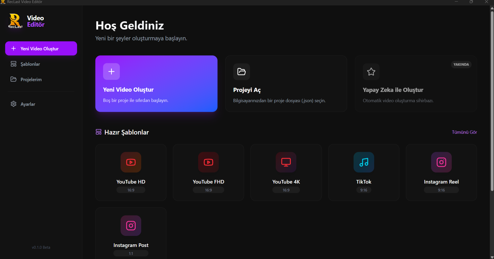

# RecLast Video Editör

RecLast Video Editör is a modern, desktop-based video editing application built with **Electron**, **React**, and **TypeScript**. It provides a smooth and intuitive timeline-based editing experience for creating videos for various platforms like YouTube, TikTok, and Instagram.



## 🚀 Features

### ✅ Implemented Features
- **Project Management**
  - **Startup Screen:** Create new projects, load existing ones (`.json`), or choose from templates.
  - **Templates:** Pre-defined aspect ratios for YouTube (16:9), TikTok (9:16), Instagram (1:1), and more.
  - **Recent Projects:** Quickly access your previously worked-on projects.
  - **Auto-Save:** Projects are saved locally.

- **Timeline & Editing**
  - **Multi-Track Timeline:** Support for unlimited Video and Audio tracks.
  - **Drag & Drop:** Easily drag media from the Media Panel to the Timeline.
  - **Clip Manipulation:**
    - **Move:** Drag clips to rearrange them.
    - **Trim/Resize:** Drag clip edges to trim start/end points.
    - **Split:** Cut clips at the playhead position.
    - **Delete:** Remove unwanted clips.
  - **Magnetic Snapping:** Toggleable snapping to align clips perfectly.
  - **Filmstrip View:** Visual thumbnail sequence for video clips.
  - **Zoom Controls:** Zoom in/out for precise editing.
  - **Keyboard Navigation:** Use Arrow keys to move playhead by 1 second.

- **Preview & Playback**
  - Real-time video preview.
  - Play, Pause, and Seek controls.
  - Frame-accurate time display.

- **Properties & Settings**
  - **Clip Properties:** Adjust Volume, Speed, and Opacity for selected clips.
  - **Project Settings:** Custom resolution and FPS settings.

- **Media Management**
  - Import Video, Audio, and Image files.
  - Preview media before adding to timeline.

### 🚧 Roadmap (Upcoming Features)
- [ ] **Rendering Engine:** Export final projects to MP4/WebM formats.
- [ ] **Effects Library:** Video filters, transitions, and color correction.
- [ ] **Text & Titles:** Rich text editor for overlays, subtitles, and titles.
- [ ] **Drawing Tools:** Annotate videos with freehand drawing.
- [ ] **AI Integration:** AI-powered features for auto-editing, background removal, and asset generation.

## 🛠️ Tech Stack
- **Core:** [Electron](https://www.electronjs.org/), [React](https://react.dev/), [TypeScript](https://www.typescriptlang.org/)
- **Build Tool:** [Vite](https://vitejs.dev/)
- **Styling:** [Tailwind CSS](https://tailwindcss.com/)
- **State Management:** [Zustand](https://github.com/pmndrs/zustand)
- **Icons:** [Lucide React](https://lucide.dev/)
- **Drag & Drop:** Native HTML5 DnD

## 📦 Installation & Running

### Prerequisites
- Node.js (v16 or higher)
- npm or yarn

### Steps
1. **Clone the repository**
   ```bash
   git clone https://github.com/RecLastTV/reclastvideoeditor.git
   cd reclastvideoeditor
   ```

2. **Install dependencies**
   ```bash
   npm install
   ```

3. **Run in Development Mode**
   ```bash
   npm run electron:dev
   ```

4. **Build for Production**
   ```bash
   npm run electron:build
   ```

## 🤝 Contributing
Contributions are welcome! Please feel free to submit a Pull Request.

## 📄 License
This project is licensed under the MIT License.
